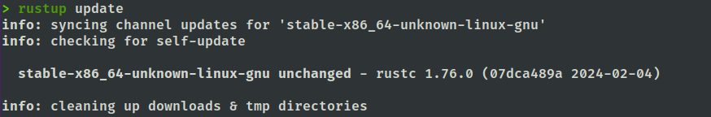
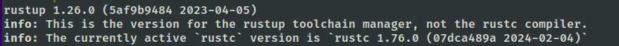
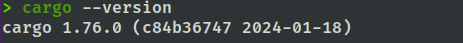

# Getting Started with Rust

## Installation

To install Rust, follow these steps:

1. Install Rustup and  Cargo

```bash
curl --proto '=https' --tlsv1.2 -sSf https://sh.rustup.rs | sh
```

2. Verify installation

- Check is rust up to date

```bash
rustup update
```

Expected result



- Check rustup version
  
```bash
rustup --version
```

Expected result:



- Check cargo version

```bash
cargo --version
```

Result:


